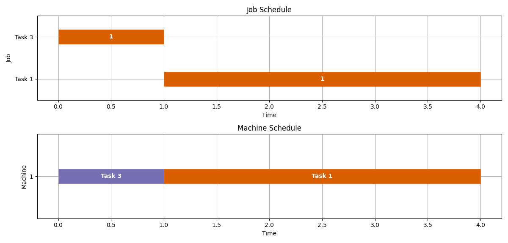

# Quantum job sequencing algorithm

This repository contains sample code for solving job sequencing problem (JSP) with deadlines using quantum annealing.

Key features include:
- JSP to QUBO converter,
- JSP to linear programming converter,
- Brute-force solver (small scale refence),
- PULP solver (linear programming),
- DWave solver (quantum annealer).

## Problem formulation

Input:
- There exists n tasks and 1 worker,
- Worker can execute only 1 task at a time,
- Each task has deadline d_i, runtime t_i and reward p_i,
- Reward is given for each task that completes before deadline,
- Tasks can be executed in any order.
Target:
- Find optimal job sequence, that maximizes total reward.

## Quick-start

Install dependencies
```bash
pip install -r requirements.txt
```

Prepare random task instance and compute schedule using LP solver (pulp)
```python
from utils import make_random_task, visualize
from solver import solve_qubo
from qubo import make_qubo, decode_result

times, deadlines, profits = make_random_task(num_jobs = 4, max_time = 5)
Q = make_qubo(times, deadlines, profits)
spins, energy = solve_qubo(Q, engine = "pulp")
results, score = decode_result(times, deadlines, profits, spins)
print("Total score is %d" % score)
visualize(results, save = "schedule.png")
```

You can find job schedule results dict or in `schedule.png`.



For quantum annealer backend register on [D-Wave Leap](https://cloud.dwavesys.com/leap/) and insert your API_KEY below:
```python
spins, energy = solve_qubo(Q, engine = "dwave", API_KEY = "YOUR_API_KEY_HERE")
```
